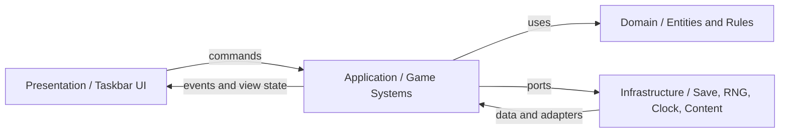
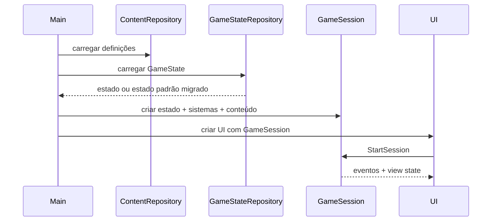
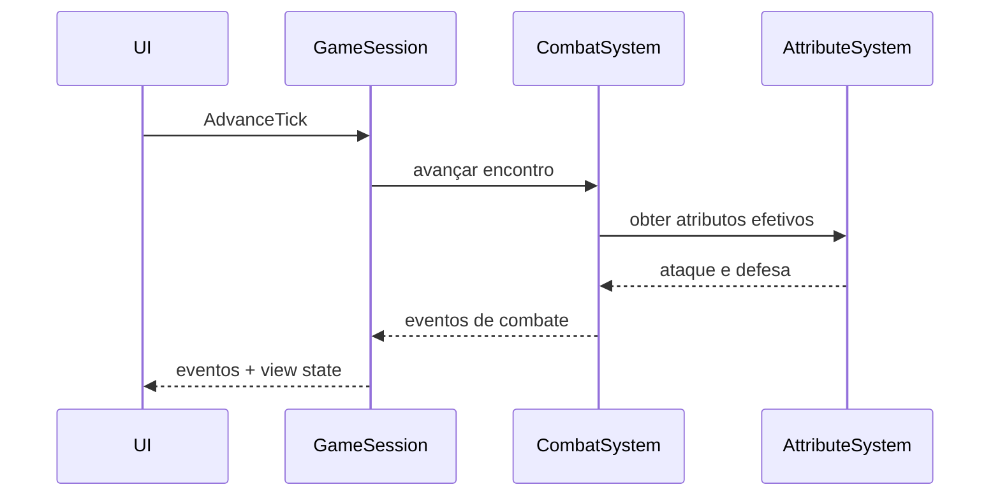
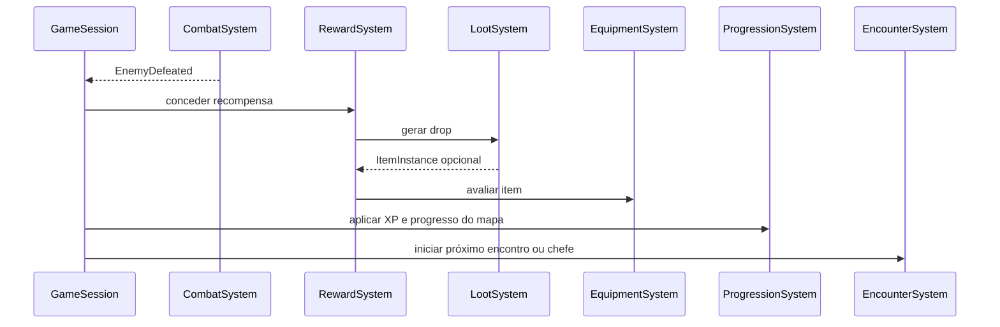
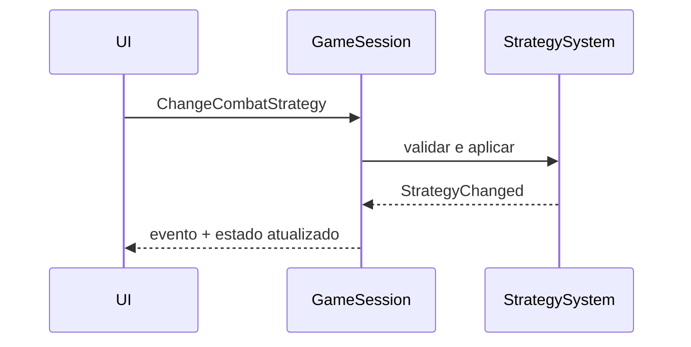
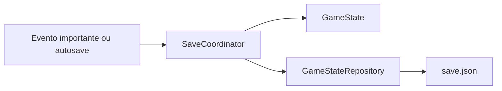

# Arquitetura Técnica

## Objetivo

Definir a arquitetura técnica futura do TBH2 e alinhar a implementação atual aos
domínios necessários para mapas, atos, dificuldades, ouro, estratégias, loot
escalável e classes.

Este documento descreve responsabilidades, limites e fluxo de dados. Ele não
define fórmulas de balanceamento nem solicita implementação imediata.

## Status

Draft

## Dependências

- [Gameplay central](../core/01_CORE_GAMEPLAY.md)
- [Progressão](../core/02_PROGRESSION.md)
- [Combate](../core/03_COMBAT.md)
- [Loot e economia](../core/04_LOOT_ECONOMY.md)
- [Sistema de herói](../heroes/01_HERO_SYSTEM.md)
- [Classes](../heroes/02_CLASSES.md)
- [Sistema de monstros](../monsters/01_MONSTER_SYSTEM.md)
- [Estrutura do mundo](../maps/01_WORLD_STRUCTURE.md)
- [Sistema de itens](../items/01_ITEM_SYSTEM.md)
- [Sistema de save](01_SAVE_SYSTEM.md)
- [Modelo de dados](02_DATA_MODEL.md)
- [Fórmulas de balanceamento](03_BALANCE_FORMULAS.md)

## Visão Geral

### Estado Atual

O protótipo atual possui uma separação inicial por pastas:

- `hero`: estado e progressão do herói;
- `enemies`: definição e geração de inimigos;
- `items`: catálogo fixo e sorteio de loot;
- `combat`: loop, vitória, derrota, experiência e loot;
- `save`: leitura e escrita de `save.json`;
- `ui`: janela, agendamento do loop, apresentação e autosave.

Essa estrutura é adequada para provar o combate básico, mas apresenta limitações
para a evolução do GDD:

- `CombatEngine` coordena regras de vários domínios;
- inimigos escalam diretamente pelo nível do herói, sem contexto de campanha;
- itens são instâncias fixas e não possuem base, origem ou Poder escalável;
- o herói concentra estado, cálculo de atributos e serialização;
- o save persiste apenas o herói, não a campanha completa;
- a UI controla o relógio do jogo e decide eventos de persistência;
- ouro, estratégias, mapas, atos, dificuldades e classes não possuem modelos
  próprios;
- conteúdo e regras estão codificados nos mesmos módulos.

### Direção Arquitetural

A arquitetura futura deve usar quatro camadas leves:

1. **Domínio:** entidades, objetos de valor e regras puras.
2. **Aplicação:** sistemas que executam casos de uso e coordenam o domínio.
3. **Infraestrutura:** save, relógio, geração aleatória e carregamento de conteúdo.
4. **Apresentação:** interface de Taskbar e adaptação de eventos para o usuário.

O projeto não precisa adotar um framework de arquitetura. A separação existe para
manter dependências previsíveis e permitir testes sem interface gráfica.

### Princípio Central

O estado persistente da partida deve ser representado por um agregado
`GameState`. Sistemas de aplicação recebem esse estado e comandos, aplicam regras
de domínio e retornam eventos. A interface apresenta os eventos, mas não decide
recompensas, progressão ou regras de combate.



## Estrutura

### 1. Entidades do Domínio

#### GameState

Agregado raiz da partida persistente.

Responsabilidades:

- reunir o estado do herói, campanha, economia e estatísticas;
- garantir que o save represente uma fotografia consistente;
- fornecer um único ponto de entrada para carregamento e persistência;
- armazenar a versão do esquema de dados.

Relações:

- possui um `Hero`;
- possui um `CampaignProgress`;
- possui uma `Wallet`;
- possui `GameStatistics`;
- referencia o encontro atual quando ele precisar ser persistido.

Não deve:

- acessar arquivos;
- controlar timers;
- criar widgets;
- conter catálogos completos de conteúdo.

#### Hero

Entidade persistente que representa o aventureiro.

Responsabilidades:

- identidade, nível, experiência e vida atual;
- referência à classe selecionada;
- estratégia de combate ativa;
- equipamentos por espaço;
- progressão individual e estatísticas do herói.

O herói não deve conhecer mapas, probabilidades de loot ou formato JSON.

#### HeroClass

Definição de classe, inicialmente representada por `Adventurer` e futuramente por
`Warrior`, `Archer`, `Mage` e `Healer`.

Responsabilidades:

- identidade da classe;
- atributos base;
- modificadores de crescimento;
- referências a habilidades automáticas;
- estatísticas secundárias futuras.

Classes devem ser definições de conteúdo ou estratégias de cálculo, não subclasses
com cópias completas do comportamento de `Hero`.

#### CombatStrategy

Objeto de valor que representa `AGGRESSIVE`, `BALANCED` ou `DEFENSIVE`.

Responsabilidades:

- fornecer modificadores de Ataque e Defesa;
- permanecer independente da classe;
- ser serializável por identificador estável.

#### AttributeSet

Objeto de valor para atributos calculados.

Responsabilidades:

- agrupar Vida Máxima, Ataque e Defesa;
- reservar extensão para Velocidade de Ataque, Crítico, Precisão, Esquiva e
  Regeneração;
- diferenciar atributos base de atributos efetivos.

O cálculo completo deve ser realizado por um serviço de domínio, preservando a
ordem:

`base + progressão + classe + equipamento -> estratégia -> atributos efetivos`

#### MonsterDefinition

Definição imutável de um tipo de monstro.

Responsabilidades:

- identificador, nome e perfil base;
- valores de referência;
- recompensas base;
- tags de conteúdo e mapas permitidos.

Exemplos: Goblin, Lobo e Esqueleto.

#### MonsterInstance

Entidade transitória de um encontro.

Responsabilidades:

- referência à definição;
- nível ou faixa de poder gerada;
- Vida Máxima e vida atual;
- Ataque e demais atributos efetivos;
- recompensa calculada;
- indicação de monstro comum, elite ou chefe.

#### BossDefinition

Especialização de conteúdo para chefes.

Responsabilidades:

- identidade própria;
- ato e mapa associados;
- modificadores de encontro;
- recompensa especial;
- condição de conclusão do ato.

O combate deve operar sobre a mesma interface de participante usada por monstros
comuns, evitando um segundo motor exclusivo para chefes.

#### ItemBase

Definição imutável de uma família de item.

Responsabilidades:

- identificador e nome;
- espaço de equipamento;
- atributo principal;
- faixa base de Poder;
- identidade visual e restrições futuras.

#### ItemInstance

Entidade persistente de um item gerado.

Responsabilidades:

- identificador único;
- referência ao `ItemBase`;
- raridade;
- Poder;
- nível do item;
- bônus primário;
- bônus secundários opcionais;
- origem do drop.

#### ItemOrigin

Objeto de valor que registra:

- dificuldade;
- ato;
- mapa;
- monstro ou chefe;
- nível de referência.

Permite auditoria de balanceamento sem acoplar o item ao estado atual da campanha.

#### CampaignProgress

Entidade persistente da campanha.

Responsabilidades:

- dificuldade atual e maior dificuldade desbloqueada;
- ato e mapa atuais;
- progresso dentro do mapa;
- atos e chefes concluídos;
- marcos e desbloqueios.

#### WorldDefinition

Raiz imutável do conteúdo de campanha.

Responsabilidades:

- reunir dificuldades, atos e mapas disponíveis;
- resolver referências de conteúdo;
- validar a sequência da campanha.

Não faz parte do save. O save armazena identificadores e progresso.

#### ActDefinition

Definição imutável de um ato:

- identificador, nome e tema;
- sequência de mapas;
- chefe de encerramento;
- próximo ato.

#### MapDefinition

Definição imutável de um mapa:

- identificador e posição;
- meta de vitórias;
- conjunto de monstros;
- faixas de desafio e recompensa;
- chefe opcional;
- próximo mapa.

#### DifficultyDefinition

Definição imutável de uma dificuldade:

- identificador e ordem;
- modificadores de inimigos;
- modificadores de experiência, ouro e Poder;
- requisitos de desbloqueio.

#### Wallet

Objeto persistente da economia do jogador.

Responsabilidades:

- armazenar o saldo de ouro;
- aceitar créditos e débitos válidos;
- impedir saldo negativo quando gastos forem introduzidos.

Na v0.1, apenas créditos são utilizados.

#### GameStatistics

Entidade persistente para contadores e marcos mensuráveis.

Exemplos:

- inimigos derrotados;
- mortes;
- chefes derrotados;
- ouro total obtido;
- itens por raridade;
- maior Poder encontrado.

### 2. Sistemas do Jogo

Sistemas são serviços de aplicação. Eles coordenam entidades e serviços de
domínio, mas não contêm apresentação nem acesso direto a arquivos.

#### GameSession

Orquestrador principal da sessão.

Responsabilidades:

- possuir o `GameState` carregado;
- receber comandos da interface;
- executar ticks;
- coordenar sistemas na ordem correta;
- publicar eventos;
- expor um estado de leitura para a UI;
- sinalizar quando o estado precisa ser salvo.

Substitui o papel central hoje dividido entre `MainWindow` e `CombatEngine`.

#### CombatSystem

Responsabilidades:

- controlar turnos ou cadência do encontro;
- calcular ataques por meio de serviços de domínio;
- aplicar dano;
- detectar vitória e derrota;
- emitir eventos de combate.

Não deve:

- sortear loot;
- conceder ouro;
- avançar mapas;
- salvar o jogo;
- criar o próximo inimigo por conta própria.

#### EncounterSystem

Responsabilidades:

- iniciar o encontro apropriado para o mapa;
- selecionar uma definição permitida;
- criar `MonsterInstance`;
- criar o chefe quando a condição do mapa for atendida;
- encerrar e substituir encontros.

#### RewardSystem

Responsabilidades:

- converter uma vitória em experiência e ouro;
- solicitar uma rolagem ao `LootSystem`;
- aplicar recompensas ao `GameState`;
- emitir eventos de recompensa.

#### LootSystem

Responsabilidades:

- decidir se existe drop;
- selecionar raridade e `ItemBase`;
- calcular nível de referência e faixa de Poder;
- criar `ItemInstance` com origem;
- delegar fórmulas ao serviço de balanceamento.

#### EquipmentSystem

Responsabilidades:

- comparar itens do mesmo espaço;
- aplicar critérios de desempate;
- equipar automaticamente a melhoria;
- emitir resultado de equipamento ou descarte.

#### ProgressionSystem

Responsabilidades:

- aplicar experiência e level up;
- avançar progresso do mapa;
- concluir mapas e atos;
- desbloquear dificuldades;
- registrar marcos.

As regras detalhadas continuam pertencendo aos documentos de progressão.

#### EconomySystem

Responsabilidades:

- creditar ouro;
- futuramente validar gastos e serviços;
- registrar transações como eventos.

O `Wallet` mantém o saldo; o sistema executa os casos de uso.

#### StrategySystem

Responsabilidades:

- validar comandos de troca de estratégia;
- atualizar a estratégia persistente do herói;
- emitir evento de alteração;
- não interromper o encontro.

#### AttributeSystem

Serviço de domínio responsável por:

- calcular atributos totais do herói;
- aplicar classe, nível, equipamentos e estratégia na ordem definida;
- calcular atributos efetivos de monstros;
- preparar suporte a estatísticas secundárias.

#### ClassSystem

Integração futura responsável por:

- resolver a definição da classe;
- aplicar crescimento e modificadores;
- fornecer habilidades automáticas;
- validar equipamentos restritos, caso existam no futuro.

#### MilestoneSystem

Responsabilidades:

- observar eventos relevantes;
- registrar cada marco uma única vez;
- emitir eventos de conquista.

#### SaveCoordinator

Serviço de aplicação que decide quando persistir.

Responsabilidades:

- reagir a eventos importantes;
- executar autosave periódico;
- solicitar persistência ao repositório;
- evitar que a UI conheça detalhes de arquivo.

### 3. Serviços de Domínio e Portas

#### BalanceService

Interface para cálculos centralizados:

- atributos de inimigos;
- XP;
- ouro;
- Poder;
- conversão de Poder em atributos;
- modificadores de mapa, ato e dificuldade.

As fórmulas pertencem a
[Fórmulas de balanceamento](03_BALANCE_FORMULAS.md).

#### RandomSource

Porta para aleatoriedade.

Usada por:

- seleção de monstro;
- raridade;
- item base;
- variação de Poder.

Deve permitir semente controlada em testes.

#### GameStateRepository

Porta de persistência:

- `load() -> GameState`;
- `save(GameState)`;
- suporte futuro a migração e recuperação.

#### ContentRepository

Porta de carregamento de definições:

- mundo;
- mapas;
- monstros;
- itens;
- classes;
- dificuldades.

No início, o conteúdo pode continuar em módulos Python. A arquitetura deve
permitir migração posterior para JSON ou outro formato declarativo sem alterar os
sistemas.

#### Clock

Porta de tempo para:

- tick da sessão;
- autosave;
- habilidades futuras;
- sistemas de Taskbar futuros.

O domínio não deve chamar APIs de relógio diretamente.

### 4. Eventos e Comandos

#### Comandos

Representam intenção externa.

Comandos iniciais:

- `StartSession`;
- `AdvanceTick`;
- `ChangeCombatStrategy`;
- `CloseSession`.

Comandos futuros:

- `SelectClass`;
- `PurchaseService`;
- `ResolveRandomEvent`.

#### Eventos

Representam fatos já ocorridos.

Categorias iniciais:

- combate: ataque, dano, vitória e derrota;
- progressão: XP, level up, mapa e ato concluídos;
- recompensa: ouro, drop, item equipado ou descartado;
- campanha: chefe derrotado e dificuldade desbloqueada;
- configuração: estratégia alterada;
- persistência: save concluído ou falhou.

Eventos devem transportar dados estruturados. Texto para o log deve ser montado
pela apresentação, permitindo localização e interfaces futuras.

Não é obrigatório implementar um barramento global de eventos. Uma lista
ordenada retornada por cada comando é suficiente para a v0.1.

### 5. Fluxo de Dados

#### Inicialização



#### Tick de Combate



#### Vitória e Recompensas



#### Troca de Estratégia



#### Persistência



### 6. Responsabilidades por Camada

#### Domínio

Pode depender apenas da biblioteca padrão e de outros módulos do domínio.

Contém:

- entidades;
- objetos de valor;
- regras puras;
- eventos de domínio;
- interfaces de cálculo quando necessário.

Não contém:

- CustomTkinter;
- caminhos de arquivo;
- JSON;
- timers de interface;
- texto formatado para o usuário.

#### Aplicação

Depende do domínio e de portas.

Contém:

- `GameSession`;
- sistemas;
- comandos;
- coordenação de casos de uso;
- modelos de leitura para a UI.

Não contém:

- widgets;
- detalhes de JSON;
- catálogos hardcoded de conteúdo.

#### Infraestrutura

Implementa portas definidas pelas camadas internas.

Contém:

- repositório JSON;
- carregadores de conteúdo;
- fonte de aleatoriedade;
- relógio;
- migrações de save;
- logging técnico.

#### Apresentação

Depende da aplicação.

Contém:

- janela CustomTkinter;
- componentes visuais;
- agendamento do próximo tick;
- tradução de eventos em mensagens;
- comandos de estratégia;
- tratamento visual de erros.

A UI pode iniciar o tick por `after`, mas apenas chama `GameSession`. Ela não
executa regras.

### 7. Responsabilidades dos Módulos Futuros

| Módulo | Responsabilidade |
|---|---|
| `domain.hero` | Herói, classe, estratégia, atributos e equipamento |
| `domain.combat` | Participantes, encontro, dano e eventos de combate |
| `domain.world` | Campanha, mapas, atos, dificuldades e progresso |
| `domain.monsters` | Definições e instâncias de monstros e chefes |
| `domain.items` | Bases, instâncias, raridades, espaços e origem |
| `domain.economy` | Carteira e transações |
| `application.session` | Coordenação do ciclo completo |
| `application.systems` | Sistemas de combate, recompensa e progressão |
| `application.commands` | Intenções recebidas da apresentação |
| `application.events` | Fatos estruturados emitidos pelos sistemas |
| `application.views` | Estado de leitura preparado para a UI |
| `infrastructure.persistence` | JSON, migrações e atomicidade |
| `infrastructure.content` | Catálogos e validação de definições |
| `infrastructure.random` | Aleatoriedade real e determinística |
| `infrastructure.time` | Relógio da aplicação |
| `presentation.taskbar` | Janela, componentes e presenters |
| `bootstrap` | Composição das dependências e início do aplicativo |

### 8. Estrutura Futura de Classes Python

Estrutura de referência:

```text
src/
├── main.py
├── bootstrap.py
├── domain/
│   ├── hero/
│   │   ├── hero.py
│   │   ├── hero_class.py
│   │   ├── combat_strategy.py
│   │   ├── attributes.py
│   │   └── equipment.py
│   ├── combat/
│   │   ├── combatant.py
│   │   ├── encounter.py
│   │   ├── damage.py
│   │   └── events.py
│   ├── monsters/
│   │   ├── monster_definition.py
│   │   ├── monster_instance.py
│   │   └── boss_definition.py
│   ├── world/
│   │   ├── campaign_progress.py
│   │   ├── world_definition.py
│   │   ├── act_definition.py
│   │   ├── map_definition.py
│   │   └── difficulty_definition.py
│   ├── items/
│   │   ├── item_base.py
│   │   ├── item_instance.py
│   │   ├── item_origin.py
│   │   ├── rarity.py
│   │   └── item_slot.py
│   ├── economy/
│   │   ├── wallet.py
│   │   └── transaction.py
│   └── game_state.py
├── application/
│   ├── game_session.py
│   ├── commands.py
│   ├── events.py
│   ├── views.py
│   ├── ports/
│   │   ├── game_state_repository.py
│   │   ├── content_repository.py
│   │   ├── random_source.py
│   │   └── clock.py
│   └── systems/
│       ├── combat_system.py
│       ├── encounter_system.py
│       ├── reward_system.py
│       ├── loot_system.py
│       ├── equipment_system.py
│       ├── progression_system.py
│       ├── economy_system.py
│       ├── strategy_system.py
│       ├── attribute_system.py
│       ├── class_system.py
│       ├── milestone_system.py
│       └── save_coordinator.py
├── infrastructure/
│   ├── persistence/
│   │   ├── json_game_state_repository.py
│   │   ├── save_mapper.py
│   │   └── migrations.py
│   ├── content/
│   │   ├── python_content_repository.py
│   │   ├── content_validator.py
│   │   └── definitions/
│   ├── random/
│   │   └── python_random_source.py
│   └── time/
│       └── system_clock.py
└── presentation/
    └── taskbar/
        ├── main_window.py
        ├── presenter.py
        ├── event_formatter.py
        └── components/
```

Essa árvore é uma direção, não uma exigência de criar um arquivo para cada classe
imediatamente. Módulos pequenos podem permanecer agrupados até existir complexidade
real.

### 9. Classes e Interfaces Principais

| Classe ou interface | Camada | Papel |
|---|---|---|
| `GameState` | Domínio | Estado persistente completo |
| `Hero` | Domínio | Entidade do aventureiro |
| `HeroClass` | Domínio | Definição de classe |
| `CombatStrategy` | Domínio | Postura persistente |
| `CampaignProgress` | Domínio | Posição e desbloqueios |
| `MonsterDefinition` | Domínio | Conteúdo base de monstro |
| `MonsterInstance` | Domínio | Estado do inimigo atual |
| `ItemBase` | Domínio | Família de equipamento |
| `ItemInstance` | Domínio | Item gerado e persistente |
| `Wallet` | Domínio | Saldo de ouro |
| `GameSession` | Aplicação | Orquestra comandos e sistemas |
| `CombatSystem` | Aplicação | Resolve combate |
| `ProgressionSystem` | Aplicação | Resolve avanço |
| `LootSystem` | Aplicação | Gera itens escaláveis |
| `RewardSystem` | Aplicação | Distribui recompensas |
| `GameStateRepository` | Porta | Contrato de persistência |
| `ContentRepository` | Porta | Contrato de conteúdo |
| `JsonGameStateRepository` | Infraestrutura | Persistência em JSON |
| `MainWindow` | Apresentação | Interface de Taskbar |

### 10. Mapeamento da Implementação Atual

| Atual | Destino futuro | Observação |
|---|---|---|
| `hero.hero.Hero` | `domain.hero.Hero` | Remover serialização e delegar cálculos compostos |
| `enemies.enemies.Enemy` | `MonsterInstance` | Separar definição de instância |
| `generate_enemy` | `EncounterSystem` + `ContentRepository` | Usar mapa, ato e dificuldade |
| `items.items.Item` | `ItemBase` + `ItemInstance` | Adicionar Poder, origem e identificador |
| `LOOT_TABLE` | `ContentRepository` | Separar catálogo da regra de drop |
| `roll_loot` | `LootSystem` | Receber contexto de campanha |
| `combat.CombatEngine` | `CombatSystem` + sistemas de aplicação | Separar combate, recompensa e progressão |
| `CombatEvent` | eventos estruturados de aplicação | Remover texto pronto do domínio |
| `save.SaveManager` | `JsonGameStateRepository` | Persistir `GameState` versionado |
| `ui.MainWindow` | apresentação + presenter | Remover regras e decisão de save |
| `main.main` | `bootstrap` | Compor dependências explicitamente |

### 11. Ordem Recomendada de Migração

1. Introduzir `GameState` e `CampaignProgress` sem alterar o loop visível.
2. Mover serialização para mappers e persistir um save versionado.
3. Separar `MonsterDefinition` de `MonsterInstance`.
4. Extrair recompensas e progressão do `CombatEngine`.
5. Introduzir mapas, atos e dificuldade Normal no `EncounterSystem`.
6. Introduzir `Wallet` e recompensas de ouro.
7. Introduzir `CombatStrategy` e `AttributeSystem`.
8. Substituir itens fixos por `ItemBase` e `ItemInstance`.
9. Preparar `HeroClass` com a definição neutra `Adventurer`.
10. Adaptar a UI para consumir eventos e modelos de leitura.

Cada etapa deve preservar um jogo executável e permitir migração de saves.

### 12. Testabilidade

O domínio e os sistemas devem funcionar sem CustomTkinter.

Testes prioritários:

- progressão de mapa e ato;
- desbloqueio de dificuldade;
- aplicação de estratégia;
- recompensas de XP e ouro;
- geração de Poder dentro da faixa;
- equipamento automático;
- encontros de chefe;
- round-trip de `GameState`;
- migração de saves antigos;
- resultados determinísticos com `RandomSource` controlado.

### 13. Decisões de Escopo

- Não usar banco de dados na v0.1.
- Não exigir framework de injeção de dependência.
- Não criar um barramento global de eventos.
- Não adotar herança profunda para classes ou monstros.
- Não persistir catálogos de conteúdo dentro do save.
- Não criar um sistema genérico de componentes de entidade.
- Não dividir arquivos apenas para reproduzir a árvore proposta.

Composição explícita, dataclasses, enums, protocolos e serviços pequenos são
suficientes para a escala inicial.

## Regras

### Direção de Dependências

- apresentação depende de aplicação;
- aplicação depende de domínio e portas;
- infraestrutura implementa portas;
- domínio não depende de apresentação ou infraestrutura;
- conteúdo referencia identificadores de domínio;
- nenhuma entidade grava ou lê arquivos.

### Fonte de Verdade

- regras de produto permanecem nos documentos de domínio;
- fórmulas permanecem em
  [Fórmulas de balanceamento](03_BALANCE_FORMULAS.md);
- contratos de dados permanecem em
  [Modelo de dados](02_DATA_MODEL.md);
- este documento define limites técnicos e colaboração entre módulos.

### Estado e Conteúdo

- estado mutável pertence a `GameState` e entidades de runtime;
- definições de conteúdo são imutáveis;
- saves armazenam estado e identificadores;
- conteúdo é carregado separadamente e validado na inicialização.

### Compatibilidade

- identificadores persistidos devem ser estáveis;
- novos campos de save precisam de defaults ou migração;
- eventos e modelos de leitura podem evoluir sem alterar entidades salvas;
- classes futuras devem estender dados e regras, não substituir o herói.

## Dados

### Agregados Persistentes

| Agregado | Conteúdo |
|---|---|
| `GameState` | versão, herói, campanha, carteira e estatísticas |
| `Hero` | progressão, estratégia, classe e equipamentos |
| `CampaignProgress` | dificuldade, ato, mapa e desbloqueios |
| `Wallet` | saldo de ouro |
| `ItemInstance` | itens atualmente equipados |

### Conteúdo Não Persistente

| Definição | Identificação |
|---|---|
| `WorldDefinition` | `world_id` |
| `ActDefinition` | `act_id` |
| `MapDefinition` | `map_id` |
| `DifficultyDefinition` | `difficulty_id` |
| `MonsterDefinition` | `monster_id` |
| `BossDefinition` | `boss_id` |
| `ItemBase` | `item_base_id` |
| `HeroClass` | `class_id` |

### View State

A aplicação deve expor à UI um modelo de leitura contendo somente dados já
preparados:

- cabeçalho de campanha;
- progresso do mapa;
- herói e atributos efetivos;
- estratégia ativa;
- inimigo e vida;
- XP;
- ouro;
- equipamentos;
- estado do encontro;
- eventos recentes.

O modelo de leitura não é persistido.

## Pendências

- Aprovar se o encontro atual fará parte do save ou será sempre recriado.
- Definir o esquema inicial de `GameState` em
  [Modelo de dados](02_DATA_MODEL.md).
- Definir identificadores estáveis para conteúdo.
- Definir o formato inicial do `ContentRepository`.
- Aprovar a ordem exata de sistemas após uma vitória.
- Definir fórmulas e limites em
  [Fórmulas de balanceamento](03_BALANCE_FORMULAS.md).
- Planejar a migração do `save.json` atual.

## Histórico de Alterações

- 2026-06-10: criada a arquitetura técnica inicial a partir do GDD refinado e da
  implementação do protótipo.

